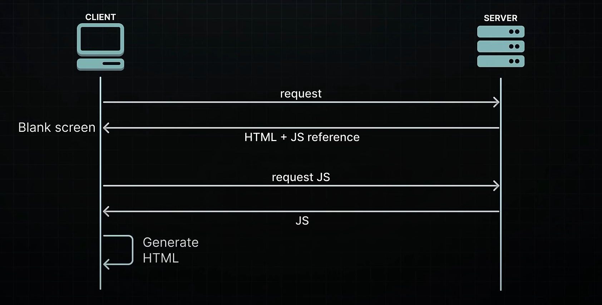
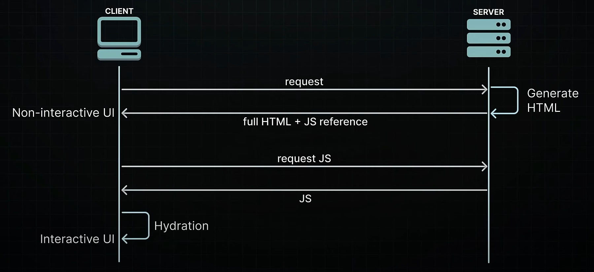
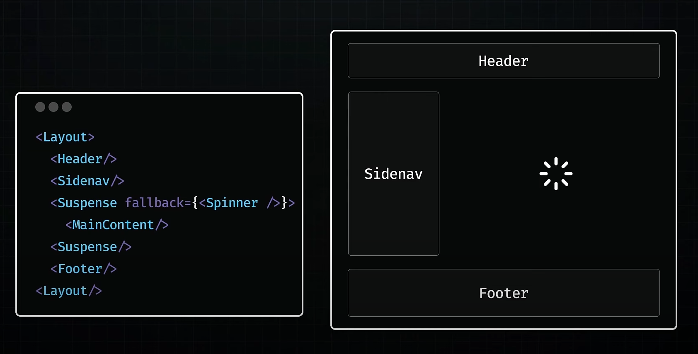
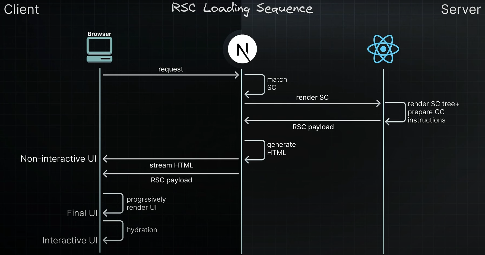
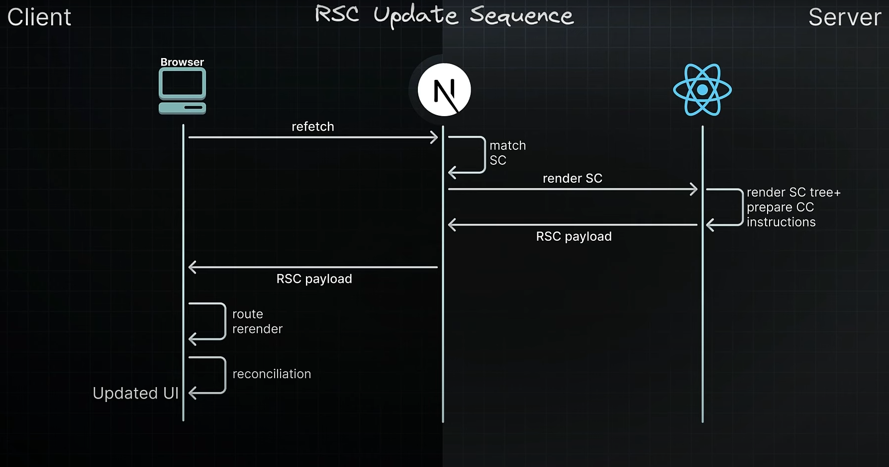

# 📚 Next.js 15 Learning Guide

## 📁 Project Structure

- recommended Layout
  - Modular Separation: Store core business logic, components, and utilities in shared folders (e.g. `lib/`, `components/`, `utils/`, `services/`) outside of the `app/` directory.
  - purpose of `app/`: only for defining routes, layouts, and loading/error UI patterns.

📂 Example Structure:

```txt
my-project/
├── app/                # Routing logic (Next.js 15)
│   ├── layout.tsx
│   ├── page.tsx
│   └── (shop)/         # Route group
├── components/         # Reusable UI components
├── lib/                # Business logic, DB, APIs
├── styles/             # Global or module styles
└── utils/              # Helper functions

```

---

## 🧭 Routing & Layouts

- route groups
  - group routes by shared layout using route groups:

```txt
app/
└── (shop)/
    ├── cart/
    └── account/
└── checkout/

```

- `cart` and `account` share the same layout defined in `(shop)/layout.tsx`.
- `checkout` has a separate layout.

- layout Nesting
  - use nested layouts to compose UIs like sidebars, headers, or dashboards.
  - each segment (`layout.tsx`) wraps only its children.

## 🔗 Linking & Navigation

---

### How Navigation Works in Next.js

- server Rendering:
  - uses React Server Components (RSC).
  - enables streaming and prefetching.
- prefetching:

  - links (`<Link>`) automatically prefetch pages on hover/in-viewport.

  ```jsx
  "use client";

  import Link from "next/link";
  import { useState } from "react";

  export interface HoverPrefetchLinkProps {
    href: string;
    children: React.ReactNode;
  }

  export const HoverPrefetchLink: React.FC<HoverPrefetchLinkProps> = ({
    href,
    children,
  }) => {
    const [activeHover, setActiveHover] = useState(false);

    return (
      <Link
        href={href}
        prefetch={activeHover ? null : false}
        onMouseEnter={() => setActiveHover(true)}
      >
        {children}
      </Link>
    );
  };
  ```

- client-Side Transitions:
  - fast transitions with cached data, avoiding full page reloads.

---

## 🚀 Rendering Strategies

### Server Components (RSC)

- benefits of React Server Components:
  - zero client-side JavaScript unless needed.
  - enables streaming and selective hydration.
  - built-in support for async/await in rendering.
- streaming & Hydration
  - streaming: Send HTML as it's ready (improves perceived speed).
  - selective Hydration: Hydrate only interactive components (e.g. buttons, inputs).

### RSC Payload

- contains

  - rendered server component tree
  - placeholders for client components
  - prop values passed to client

- lifecycle

  - initial Load:
    - static HTML rendered.
    - RSC payload reconciles server and client.
    - client components hydrate after page load.
  - navigation: - RSC payload is prefetched and cached. - Entire rendering is client-side for client components.

- Hydration

  - converts static HTML into interactive UI by attaching event listeners.
  - only happens on the client for Client Components.

---

## 🧩 Async Server Components

- you can await data in Server Components. Example:

  - Server Component

    ```jsx
    import db from "./database";

    async function Page({ id }) {
      const note = await db.notes.get(id);
      const commentsPromise = db.comments.get(note.id);

      return (
        <div>
          {note}
          <Suspense fallback={<p>Loading Comments...</p>}>
            <Comments commentsPromise={commentsPromise} />
          </Suspense>
        </div>
      );
    }
    ```

  - Client Component

  ```jsx
  "use client";
  import { use } from "react";

  function Comments({ commentsPromise }) {
    const comments = use(commentsPromise);
    return comments.map((comment) => <p key={comment.id}>{comment.text}</p>);
  }
  ```

---

## 🎨 Theming & UI

- dark Mode
  - easily implemented via a ThemeProvider.
  - can store theme in context or in localStorage.
  - works like traditional React theming.
- separation of Concerns
  - keep UI logic in Client Components.
  - fetch data or perform async logic in Server Components.

---

## 🧠 Context & State

- context Limitations
  - React Context does not work in Server Components.
- you must:
  - mark context providers with `"use client"`.
  - wrap them around server components.
- performance optimization:
  - render context providers deep in the tree where needed - not at root level.

---

## 📦 3rd Party Libraries

- using Client Libraries in Next.js 15

  - add `"use client"` directive to entry points that rely on:
    - window, document, or localStorage

- example:

  ```jsx
  "use client";
  import { Chart } from "chart.js";
  ```

- once defined as a Client Component, it can still be imported into Server Components.

---

## 🛡️ Environment & Safety

- protect Environment Variables
  - only expose variables prefixed with: `NEXT_PUBLIC_`
- use the `server-only` package for code that should never run on the client.
- use `client-only` to enforce browser-only logic (e.g., using `window`).

---

📥 Streaming & Fallbacks

- loading States

  - two main approaches:

    - `loading.tsx` file: wraps the entire route segment with a fallback.
    - `<Suspense>`: wraps specific components or areas for granular loading.

    ```jsx
    <Suspense fallback={<LoadingSpinner />}>
      <SomeComponent />
    </Suspense>
    ```

---

## 🧱 Error Handling

- Error Boundaries
  - catches errors during rendering, lifecycle, and suspense.
  - does not catch:
    - errors in event handlers (use `try/catch` manually)
    - errors in async callbacks outside render

---

## 🔁 Route Handlers

- similar to `page.js` and `layout.js`, but for API-like logic.
- cannot coexist with `page.js` in the same folder.
- use separate folders to define route handlers.

  ```txt
  app/
  └── dashboard/
    ├── page.js      ✅ defines a page
    └── route.js     ❌ Invalid — cannot exist with page.js

  ```

---

## 📦 Optimizing Imports in Next.js

- efficient import patterns can significantly improve your app's compilation and bundling performance.

- icon Libraries
  - many icon libraries contain thousands of icons, but most apps only use a few. Importing the entire library slows down builds.

```jsx
import { TriangleIcon } from "@phosphor-icons/react"; // ❌ avoid this:
import { TriangleIcon } from "@phosphor-icons/react/dist/csr/Triangle"; // ✅ do this instead:
```

- refer to the library documentation for optimized import paths. The example above follows the @phosphor-icons/react recommendation.

- ⚠️ when Using react-icons:

  - Stick to one icon set. Mixing multiple sets (like pi, md, tb, cg) results in tens of thousands of unnecessary modules being processed.

- 📦 `Barrel` Files

  - `barrel` files export multiple modules from a single file. While convenient, they can slow down builds due to additional parsing and side-effect checks.
  - import directly from the needed file rather than using an index or grouped export.

- next.config.js:

```jsx
module.exports = {
  experimental: {
    optimizePackageImports: ["package-name"],
  },
};
```

---

- analyze Your JavaScript Bundles
  - use `@next/bundle-analyzer` to visualize and manage your application’s bundle size.

```bash
npm i @next/bundle-analyzer
```

- configuration (next.config.js)

  ```js
  /\*_ @type {import('next').NextConfig} _/;
  const nextConfig = {};

  const withBundleAnalyzer = require("@next/bundle-analyzer")({
    enabled: process.env.ANALYZE === "true",
  });
  module.exports = withBundleAnalyzer(nextConfig);
  ```

- generate the report

  ```bash
  ANALYZE=true npm run build
  ```

  - this opens three interactive reports in your browser to inspect bundle sizes.

---

## DOCKER

- if you must use Docker for development, consider using Docker on a Linux machine or VM

---

## 🔁 Rendering in React

- primarly used for SPA applications

### Client-side Rendering

- the browser (client) transforms React components into what we see on screen - `client-side rendering (CSR)`

  - SPAs applications

- drawbacks of CSR
  - **SEO**: when search engines crawl site, they are mainly looking at HTML content but with CSR, our initial HTML is basically just an empty div - not great for search engines trying to figure out what our page is about (content)
    - a lot of nested components making API calls, the meaningful content might load too slowly for search engines to even catch it
  - **performance**: browser - the cleint has to do everything
    - blank screen or loading spiiner while waiting



### Server-side solutions

- search engines can now easily index the server-rendered content
- users see actual HTML content instead of blank screen or loading spinner

- **Hydration**

- during `hydration`, React takes control in the browser and reconstructs the component tree in memory, using the server-rendered HTML as a blueprint
- maps out where all the interactive elements should go, then hooks up the JS logic
  - initializing application state, adding event handlers and setting up all the dynmaic features

#### Static Site Generation (SSG)

- SSG happens during build time when we deploy our application to the server
  - results in pages that are already rendered and ready to serve - perfect for stable content

#### Server-Side Rendering (SSR)

- SSR renders pages on-demand when users request them - ideal for personalized content

  - significant improvement over CSR - faster initial page loads and better SEO

- drawbacks - **all or nothing waterfall**:

  - MUST fetch **everything** before we can show **anything**
    - if a component needs to fetch data from database or API, this fetching must be completed before the server can begin rendering the page - delays the server's response time to the browser
  - MUST load **everything** before can hydrate **anything**
    - for successful hydration, where React adds interactiviy to server-rendered HTML, the component tree in the browser must exactly match the server-generated component tree - all JS for components must be loaded on the client before we can start hydrating any of them
  - MUST hydrate **everything** before can interact with **anything**
    - React hydrates the component tree in a single pass - once it starts hydrating it won't stop until it's finished with the entire tree



##### <Suspense> SSR architecture

1. HTML streaming on the server
2. selective hydration on the client

- by wrapping section in a `<Suspense>` component we are enabling sreaming but also relling React that it can hydrate other parts of the page before everything's ready - **selective hydration**

  - this process is managed automatically by React
  - in scenarios where multiple components are awaiting hydration, React prioritizes hydration based on user interactions



- drawbacks of `<Suspense>` SSR
  - users still end up downloading the entire code for webpage
  - every React component gety hydrated on the client side - whether it needs interactivity or not - slowing down load times and time to interactivity by hydrating components that might just be static content
  - servers are way better at handling heavy processing, user's devices still do bulk of JS work

### React Server Components (RSC)

CSR ▶️ SSR ▶️ SSR Suspense

- new architecture designed by React team
  - leverages the strengts of both server and client environments to optimize efficiency, load times and interactivity
  - dual-component model - distinction is based on component's execution environment and the specific systems
    - `Client Components`
    - `Server Components`

#### Client Components

- primarily operate on the client but can also run once on the server for better performance
  - have full access to the client environment - browser, states effects and event listeners

#### Server Components

- designed to operate exclusively on the server

  - their code stays on the server and is never downloaded to the client
  - there is not hydration stepm najubg app load and become interactive faster
  - direct access to server-side resources
    - can communicate to databases and file systems, managing compute-intensive rendering tasks
  - enhanced security
    - sensitive data and logic never leaves the server
  - improved data fetching - Server Components are closer to data source
  - caching - no re-rendering and re-fetching data all the time
  - faster initial page load and `FCP`
  - improved SEO
  - efficient streaming - split rendering process into chunks that stream to the clients as they are ready

- **APP Router in Next.js is built entirely on the RSC architecture**

#### RSC Loading Sequence



#### RSC Update Sequence


